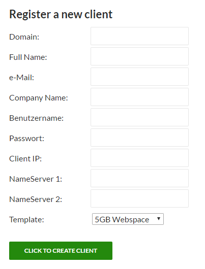
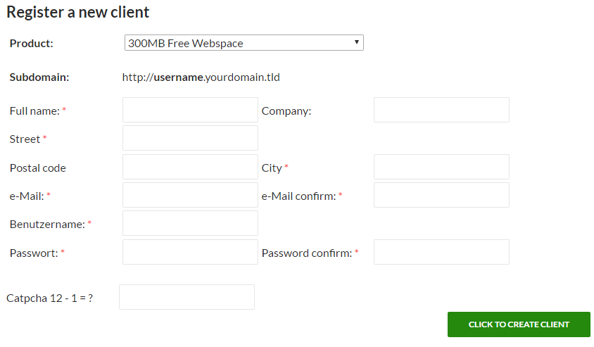

## WP-ISPConfig 3
```
Contributors: ole1986
Tags:  host, ISPConfig, hosting, remote, manager, admin, panel, control, wordpress, post, plugin, interface, server
Requires at least: 3.1
Tested up to: 4.4
Stable tag: trunk
License: GPLv2
License URI: http://www.gnu.org/licenses/gpl-2.0.html
```
<sup>originally written by etruel - https://de.wordpress.org/plugins/wp-ispconfig/ -  and optimized by ole1986</sup>

WordPress interface for ISPConfig 3 ~ Hosting Control Panel.  The plugin allows you to manage ISPConfig through SOAP requests

### Description

This wordpress plugin is used access [ISPConfig](http://www.ispconfig.org) features by connecting to its SOAP Server

By adding a remote user (through ISPConfig -> UserManagement - > Remote Users) you can manage client features, websites shell accounts, etc... directly from wordpress.

This plugin is shipped with two additional files to demonstrate a customer registration form using wordpress shortcodes.

Usage: `[ispconfig class=IspconfigRegisterClient]` or `[ispconfig class=IspconfigRegisterFree]`

Please make sure your followed the steps below before adding shortcodes

### Installation

* Search for "wp-ispconfig3" in the "Plugins -> Install" register
* Press Install followed by activate
* Setup the plugin as mentioned below 

### Configuration

Before you can start it is neccessary to setup the remote SOAP server and user credentials.

* Open the ISPConfig website with your favorite browser and login as admin.
* Navigate to `System -> User Management -> Remote User`
* Add a new remote user with a secure password

In Wordpress, once you activated the wp-ispconfig3 plugin you need to setup the `WP-ISPConfig3 -> Settings` 

`SOAP Username: remoteuser`
`SOAP Password: remoteuserpass`
`SOAP Location: http://localhost:8080/remote/index.php`
`SOAP URI: http://localhost:8080/remote/`

## Screenshots

1. Register a new customer <br />  
2. Register a new free customer <br />  
3. Plugin settings <br />  

### Add a new shortcode class

If you want to add your own registration form, do the following:

* copy one of the existing files (`ispconfig_register_client.php` or `ispconfig_register_free.php`)
* change the php class name to "IspconfigYourClass" for example
* rename the file to "ispconfig_your_class.php".
* customize the file with your needs.
* use the shortcode `[ispconfig class=IspconfigYourClass]` to display its content

PLEASE NOTE:

The autoload function uses CamelCase style to include the php classes. So, `IspconfigYourClass` will be converted to `ispconfig_your_class.php`

### License

This program is free software: you can redistribute it and/or modify it under the terms of the GNU General Public License as published by the Free Software Foundation, either version 3 of the License, or (at your option) any later version.

This program is distributed in the hope that it will be useful, but WITHOUT ANY WARRANTY; without even the implied warranty of MERCHANTABILITY or FITNESS FOR A PARTICULAR PURPOSE. See the GNU General Public License for more details.

You should have received a copy of the GNU General Public License along with WP Nofollow More Links. If not, see <http://www.gnu.org/licenses/>.

### Changelog

```
v1.0.2
* added action hook `ispconfig_options` to include additional options
* optimized th option handling

v1.0.1
* clean up code and moved code at the right places

v1.0.0
* improved version of the orginal wp-ispconfig

(original version wp-ispconfig from https://de.wordpress.org/plugins/wp-ispconfig/)
```

